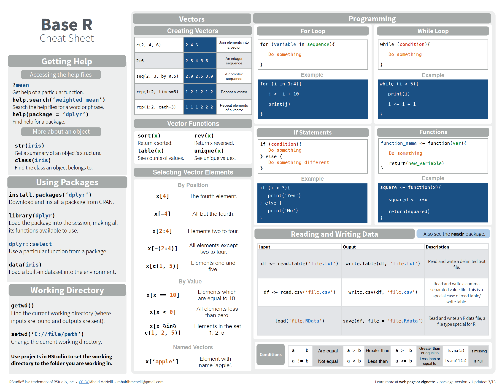

```{r setup, include = FALSE, echo = FALSE}
knitr::opts_chunk$set(
  comment = "#>",
  collapse = TRUE,
  size = "scriptsize",
  fig.retina = 0.8, # figures are either vectors or 300 dpi diagrams
  dpi = 300,
  out.width = "70%",
  fig.align = "center",
  fig.width = 6,
  fig.asp = 0.618, # 1 / phi
  fig.show = "hold"
)
```

## R Foundations

In this tutorial, you'll get an overview of the basic programming concepts in R 
and main data types. 
It's just enough to get you up and running essential R code. 
However, for true "beginners", we highly recommend going through [Advanced R - Chapter 'Foundations'](http://adv-r.had.co.nz/Data-structures.html) from which the content of this assignment is (mostly) inspired by. 

#### R, RStudio, Installation
* [__R__](https://cran.r-project.org/) is a programming language for statistical analysis
* [__RStudio__](https://www.rstudio.com/products/rstudio/download/) is the integrated development environment (IDE) for R in which we write and execute R code, plot things and write reports.
* [Installation guidelines and details (Mac, Windows, Linux)](http://web.cs.ucla.edu/~gulzar/rstudio/)

To follow the tutorial, you can start R Studio and execute statements from the code chunks in the R Console.

#### Libraries
R uses different libraries or packages to load specific functions (read excel files, talk to Twitter, generate plots).

```{r, message=F, warning=F}
# To install package from the console, note the quotation marks!
# install.packages("name_of_package")

# load package in environment
library(mgcv)
```


##### Ex. 0

As a starting point you can install a package that we'll extensively use throughout the semester:

* `tidyverse`

#### Assignment

In R, we assign values (numbers, characters, data frames) to objects (vectors, matrices, variables).
To do so, we use the `<-` operator:

```{r}
# name_of_object <- value
an_object <- 2
another_object <- "some string"
# inspect object's value
an_object
print(another_object)
```


#### Data Structures

R’s base data structures can be organised by their dimensionality (1d, 2d, or nd) and whether they’re homogeneous (all contents must be of the same type) or heterogeneous (the contents can be of different types).

| |  Homogeneous | Heterogeneous|
| :---  | :---  | :--- |
1d  |	Atomic vector |	List
2d	| Matrix	      |Data frame
nd	| Array	        |


#### Vectors

The basic data structure in R is the vector. Vectors can be of two kinds: atomic vectors and lists. They have three common properties:

* Type, `typeof()`, what it is.
* Length, `length()`, how many elements it contains.
* Attributes, `attributes()`, additional arbitrary metadata.

However, atomic vectors and lists differ in the types of their elements: __all elements__ of an atomic vector must be the __same type__, whereas the elements of a list can have different types.

There are four common types of atomic vectors: 

* logical
* integer
* double (often called numeric)
* character

Atomic vectors are usually created with `c()`, short for combine:
```{r, message=F, warning=F}
dbl_var <- c(1, 2.5, 4.5)
# with the L suffix, you get an integer rather than a double
int_var <- c(1L, 6L, 10L)
# use TRUE and FALSE (or T and F) to create logical vectors
log_var <- c(TRUE, FALSE, T, F)
chr_var <- c("these are", "some strings")

int_var <- c(1L, 6L, 10L)
typeof(int_var)

is.integer(int_var)
```


#### Lists

List objects can hold elements of any type, including lists. You construct lists by using `list()` instead of `c()`:
```{r, message=F, warning=F}
x <- list(1:3, "a", c(TRUE, FALSE, TRUE), c(2.3, 5.9))
str(x)
```


#### Attributes

All objects can have arbitrary additional attributes, used to store __metadata__ about the object. Attributes can be thought of as a named list (with unique names). They can be accessed individually with `attr()` or all at once (as a list) with `attributes()`.

```{r, message=F, warning=F}
y <- 1:10
attr(y, "my_attribute") <- "This is a vector"

# inspect the attribute of y
attr(y, "my_attribute")
```

#### Matrices and arrays
Adding a `dim` attribute to an atomic vector allows it to behave like a multi-dimensional array. A special case of the array is the matrix, which has two dimensions. 
Matrices and arrays are created with `matrix()` and `array()`, or by using the assignment form of `dim()`:

```{r, message=F, warning=F}
# two scalar arguments to specify rows and columns
a <- matrix(1:6, ncol = 3, nrow = 2)
# one vector argument to describe all dimensions
b <- array(1:12, c(2, 3, 2))

# you can also modify an object in place by setting dim()
c <- 1:6
dim(c) <- c(3, 2)
c
```

`length()` and `names()` have high-dimensional generalisations:

* `length()` generalises to `nrow()` and `ncol()` for matrices, and `dim()` for arrays.

* `names()` generalises to `rownames()` and `colnames()` for matrices, and `dimnames()`, a list of character vectors, for arrays.

`c()` generalises to `cbind()` and `rbind()` for matrices, and to `abind()` (provided by the abind package) for arrays. You can transpose a matrix with `t()`; the generalised equivalent for arrays is `aperm()`.

You can test if an object is a matrix or array using `is.matrix()` and `is.array()`, or by looking at the length of the `dim()`. `as.matrix()` and `as.array()` make it easy to turn an existing vector into a matrix or array.

#### Data frames

A data frame is the most common way of storing data in R, and if used systematically makes data analysis easier. Under the hood, a data frame is a __list of equal-length vectors__. This makes it a __2-dimensional__ structure, so it shares properties of both the matrix and the list. This means that a data frame has `names()`, `colnames()`, and `rownames()`, although `names()` and `colnames()` are the same thing. The `length()` of a data frame is the length of the underlying list and so is the same as `ncol()`; `nrow()` gives the number of rows.

```{r, message=F, warning=F}
df <- data.frame(x = 1:3, y = c("a", "b", "c"))
str(df)
```

You can combine data frames using cbind() and rbind():

```{r, message=F, warning=F}
cbind(df, data.frame(z = 3:1))
```

#### Subsetting vectors

Let’s explore the different types of subsetting with a simple vector, `x`.
```{r, highlight = FALSE}
x <- c(2, 4, 3, 5)
```
Positive integers return elements at the specified positions:
```{r,highlight = FALSE}
x[c(3, 1)]
```

Duplicated indices yield duplicated values:
```{r, highlight = FALSE}
x[c(1, 1)]
```

Real numbers are silently truncated to integers:
```{r, highlight = FALSE}
x[c(2, 9)]
```
Negative integers omit elements at the specified positions:
```{r, highlight = FALSE}
x[-c(3, 1)]
```
You can’t mix positive and negative integers in a single subset: `x[c(-1, 2)]` is not allowed.

Logical vectors select elements where the corresponding logical value is TRUE. This is
probably the most useful type of subsetting because you write the expression that creates
the logical vector:

```{r}
x[c(TRUE, TRUE, FALSE, FALSE)]

x[x > 3]
```

A missing value in the index always yields a missing value in the output:
```{r}
x[c(TRUE, TRUE, NA, FALSE)]
```

Nothing returns the original vector. This is not useful for vectors but is 
very useful for matrices, data frames, and arrays. It can also be useful in
conjunction with assignment.

```{r}
x[]
```
Zero returns a zero-length vector. This is not something you usually do on 
purpose, but it can be helpful for generating test data.
```{r}
x[0]
```

If the vector is named, you can also use character vectors to return elements with matching names:
```{r}
(y <- setNames(x, letters[1:4]))

y[c("d", "c", "a")]
```
Like integer indices, you can repeat indices:
```{r}
y[c("a", "a", "a")]
```

When subsetting with `[` names are always matched exactly
```{r}
z <- c(abc = 1, def = 2)
z[c("a", "d")]
```

#### Subsetting lists, matricies and data frames


Subsetting a list works in the same way as subsetting an atomic vector. Using `[` will always return a list;
`[[` and `$`, as described below, let you pull out the components of the list.


You can subset higher-dimensional structures in three ways:

* With multiple vectors.
* With a single vector.
* With a matrix.
```{r}
a <- matrix(1:9, nrow = 3)
colnames(a) <- c("A", "B", "C")
# multiple vectors
a[1:2, ]

df <- data.frame(x = 1:3, y = 3:1, z = letters[1:3])
# selecting by value of certain vector
df[df$x == 2, ]
```


#### Importing data in R

The following checklist makes it easier to import data correctly into R:

* The first row is maybe reserved for the header, while the first column is used to identify the sampling unit;
* Avoid names, values or fields with blank spaces, otherwise each word will be interpreted as a separate variable, resulting in errors that are related to the number of elements per line in your data set;
* Short names are preferred over longer names;
* Try to avoid using names that contain symbols such as `?`, `$`,`%`, `^`, `&`, `*`, `(`, `)`,`-`,`#`, `?`,`,`,`<`,`>`, `/`, `|`, `\`, `[` ,`]` ,`{`,  and `}`;
* Make sure that any missing values in your data set are indicated with NA.


```{r,  message=F, warning=F}
library(readr)

# import data from .txt file
df <- read_table(
  "https://s3.amazonaws.com/assets.datacamp.com/blog_assets/test.txt",
  col_names = FALSE
)
df

# import data from .csv file
df <- read.table(
  "https://s3.amazonaws.com/assets.datacamp.com/blog_assets/test.csv",
  header = TRUE,
  sep = ","
)
```
#### Functions

Standard format for defining a function in R:
```{r}
my_function_name <- function(arg1 = "default", arg2 = "default") {

  # 'cat' is used for concatenating strings
  merged_string <- cat(arg1, arg2)

  # if not specified, last evaluated object is returned
  return(merged_string)
}

# call a function elsewhere from code
arg1 <- "Hello"
arg2 <- "World!"
a_greeting <- my_function_name(arg1, arg2)
print(a_greeting)
```

[CRAN](https://cran.r-project.org/) - the curated repository of R packages provides millions of functions that you could use to tackle data. You simply need to install a package, and then call the function from your R code `function_name(somearguments)`. For example, the package `stats` helps you in fitting linear models through the function `lm()`:
```{r}
library(stats)

x <- rnorm(500)
y <- x * 4 + rnorm(500)

lm.fit <- lm(y ~ x, data = data.frame(x, y))

print(lm.fit)
```

How many functions have been used in the example? What does `rnorm` mean? You can get informed about any R function by using its documentation `?function_name` or `?packageName::function_name`.

#### Cheat sheets

##### Base R Cheat sheet


##### Data Types Cheat sheet


### Try it yourself!

##### Exercise 1

Try to figure out the answers without executing the code. Check your answers in R Studio.

a) Given the vector: `x <- c("ww", "ee", "ff", "uu", "kk")`, what will be the output for `x[c(2,3)]` ?

b) Let `a <- c(2, 4, 6, 8)` and `b <- c(TRUE, FALSE, TRUE, FALSE)`, what will be the output for the R expression `max(a[b])`?

c) Is it possible to apply the function `my_function_name` using `x` and `a` as arguments?

##### Exercise 2
Consider a vector `x` such that:
`x <- c(1, 3, 4, 7, 11, 18, 29)`
Write an R statement that will return a list `X2` with components of value:
x\*2, x\/2, sqrt(x) and names 'x\*2', 'x\/2', 'sqrt(x)'.

##### Exercise 3

Read the file [Table0.txt](Table0.txt) into an object DS.

a) What is the data type for the object DS?
b) Change the names of the columns to Name, Age, Height, Weight and Sex.
c) Change the row names so that they are the same as Name, and remove the variable Name.
d) Get the number of rows and columns of the data.

##### Exercise 4

a) Convert DS from the previous exercise to a data frame DF.
b) Add an additional column "zeros" in DF with all elements 0.
c) Remove the Weight column from DF.


